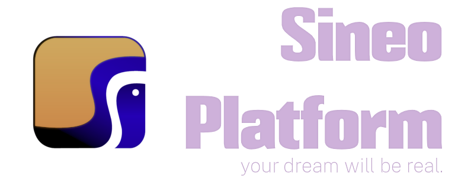

Daniel Lee (neo)

github: https://github.com/iondis/bitright

SineoPlatform is a proof of concept project for blockchain based digital copyright protection. Users can upload media files that they create and permanently claim ownership of their work. Anyone on the web can view the published works and verify that the author is correct. Further, it is not possible to upload a work that is too similar to one that has already been published. Audio, image, and text files are currently supported.

# Installing
**1st Run: Run the following commands from inside the project directory. The installation is going to take a few minutes to install all related packages in the virtual environment** 
```
source ./install.sh
python network.py
```
**Subsequent Runs:**
```
source ./run.sh
```
**We provides some example media files in media/ folder for you to test it out**

# How it Works
Whenever a user uploads a file, a new block is added to the blockchain. This block contains the title and author of the work, a path/link to download the file, a hash of the file, the public key of the author, the timestamp, and the hash of the previous block. A hash of the file is used instead of the raw data to keep block sizes smaller. The public key of the author is included so that knowledge of the corresponding secret key allows the author to prove ownership. Like any blockchain, the hash of the previous block allows users to verify that the chain has not been tampered with.

# Media Comparison
In order for a block to be considered valid, the uploaded work must not be too similar to any previous files on the chain. We use perceptual hashing to perform this comparison. A perceptual hash generates a short fingerprint for a file, such that small changes to the file only result in small changes to the fingerprint. Then if the fingerprints are too similar, it is safe to conclude that the files are too similar. To create the fingerprints, we use open source software that was made for this purpose. 

Audio comparison: [AcoustID](https://acoustid.org/)

Image comparison: [ImageMatch](https://github.com/EdjoLabs/image-match)

Text comparison: [TLSH](https://github.com/trendmicro/tlsh)

# Limitations
In practice, the blockchain should not be hosted from a single server. A major advantage of using a blockchain is that there is no trusted authority for what is on the chain. In order to achieve this, we would need to add a lot of code for networking and communication between worker nodes. We also have not implemented a way of preventing adversarial mining. Proof of work could potentially be used, but there is currently no reward for successfully mining a block. If this was implemented, there would need to be transaction fees so that miners would have incentive to publish blocks.

Another limitation is that as the blockchain grows, comparing new fingerprints with all of the old ones becomes increasingly computationally difficult. Perhaps probabilistically checkable proofs (PCPs) could be used to speed up the verification process. Scalability seems to be the largest hurdle if this project were to be implemented in the real world.

# Vision
The SineoPlatform project envisions a globally recongized platform for digital rights management with built in support for royalty management and dynamic tagging of web assests, providing a fairer and more lucrative envrionment for both users and content creators. 

# Challenges
One of the key challenges with the project is determining a reasonable apporach to verifing the uniqueness of digital assests. In the project, media comparison libraries are used, however, these libraries are not without its flaws. From varying accuracies to determining a suitable "uniqueness" threshold, these libraries are far from perfect. Moreover, there is no general comparison library for all file types. Libraries only cater to a specific set of file types.

# Takeaways
- DRM is a hard problem. There is no straight forward way to solving it.
- While blockchains might be an approach to digital intellectual property identification and protection, it may not be the best approach due to its many limitations.
- Digital media comparison is a tricky and subjective field. A lot more research and innovation are required to achieve SineoPlatform's vision.
